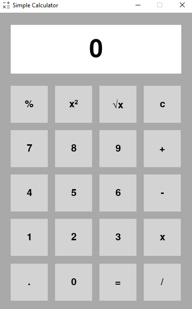

# Simple Calculator

## Overview

This project is a simple calculator implemented using the Python programming language and the Pygame library. The calculator provides basic arithmetic operations, as well as additional functionalities such as percentage, square, and square root calculations.



## Installation

1. Close this repository.

```bash
git clone https://github.com/TerenceCLZhang/Simple-Calculator.git
```

2. Install Pygame.

```bash
pip install pygame
```

3. Run the calculator by double clicking on `main.py` or running the command:

```bash
cd Simple-Calculator
python main.py
```

## Acknowledgements

Icon source from [https://iconduck.com/icons/183747/math]{Iconduck}.
